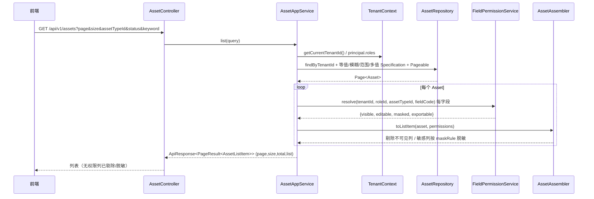
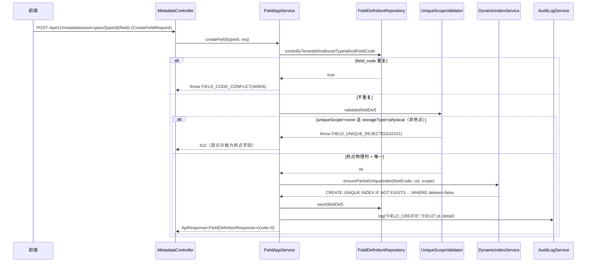

# MVP-1 元数据与资产核心 — 系统架构设计（高见远 / Bob）

> 阶段：MVP-1（基于 MVP-0 平台底座）
> 输入：产品经理 PRD（`MVP1-PRD-许清楚.md`）+ 规范 01~17
> 产出：实现蓝图 + 任务分解（交付工程师）
> 设计原则：沿用 MVP-0 约定；模块化单体（新增 `metadata` / `asset` 包）；不修改 MVP-0 已验证的认证/租户/角色/权限/强制改密逻辑（仅最小兼容改动并配回归测试）。

---

## 1. 实现方案 + 框架选型

### 1.1 框架选型（沿用 MVP-0，不切换）

| 层 | 选型 | 说明 |
|---|---|---|
| 后端 | Spring Boot 3.3.5 + Java 21 | `pom.xml` 已锁定 |
| 持久化 | Spring Data JPA + Hibernate 6 | 已验证；JSONB 用 `@JdbcTypeCode(SqlTypes.JSON)` + `@Column(columnDefinition="jsonb")`（见 `audit/AuditLog.java`） |
| 安全 | Spring Security（无状态 JWT） | `SecurityConfig` 已配置 `@PreAuthorize` + `OncePerRequestFilter`；`requestMatchers` **不含 `/api` 前缀**（因 `server.servlet.context-path=/api`），新增 MVP-1 接口无需改动 `SecurityConfig`（全部走 `.anyRequest().authenticated()`） |
| 迁移 | Flyway（`baseline-on-migrate=true`，`baseline-version=0`） | 新文件从 **V3** 续接（V1 平台 schema、V2 种子已应用） |
| 前端 | Vue 3 + TS + Vite + Element Plus + Pinia + Vue Router | 沿用现有 `request.ts` 统一 client（`code=0` 解包、401 刷新、403 提示）、`StateView` 四态、`useViewState`、`useUserStore.hasPermission` |
| 文档 | springdoc / OpenAPI | 新 Controller 自动进 `/v3/api-docs` |

**结论**：MVP-1 **无新增运行时框架依赖**，仅测试域可能新增 Testcontainers（见 §6）。

### 1.2 架构与分层

模块化单体，严格遵循 `03` 文档分层 `controller → application service → domain service → repository → db`：

- **`com.itam.metadata`**：资产类型、字段定义、表单/列表/查询 schema、运行时元数据聚合、字段权限默认规则引擎（元数据模块拥有字段与权限规则，资产模块消费之）。
- **`com.itam.asset`**：资产主对象、动态字段（物理列 + `attributes` JSONB）、资产关系。

**关键设计决策（落地用户 4 个拍板点）**：

1. **locations 最小表**：`locations(id/tenant_id/parent_id/name/code/path/sort_order + 公共字段)`，播种「总部机房-A01-10U」演示树；**不建 `asset_location_history`**（MVP-1 不做位置变更历史）；位置选择器数据源由新增只读端点 `GET /api/v1/metadata/locations/tree` 提供（见 §2 补充说明）。
2. **生命周期初始状态**：后端常量 `Asset.LIFECYCLE_STATUS_PLANNED = "planned"`；`asset_types.lifecycle_template_id` 列保留但 **MVP-1 不建 lifecycle 表、不实现模板/动作**；创建固定写 `planned`，编辑忽略请求中的 `lifecycleStatus`。
3. **预置字段（V4 种子）**：服务器 `brand,model,serial_no,memory_gb,cpu_spec,warranty_end_date`；网络设备 `brand,model,serial_no,management_ip,warranty_end_date`；安全设备 `brand,model,serial_no,security_zone,warranty_end_date`；软件许可证 `vendor,license_model,total_quantity,license_end_date`（其中 `license_key` 敏感+加密、脱敏 `last4`）。
4. **field_type 权威枚举（16 值，varchar 存储）**：`text, textarea, number, decimal, date, datetime, enum, multi_enum, boolean, user, org, location, asset_relation, url, json, file`。**以该枚举为单一存储真相**，06 文档的较小枚举视为该集合子集；08 额外类型已在其中，不再扩大库枚举。

### 1.3 关键技术机制

| 机制 | 方案 |
|---|---|
| **租户隔离** | 所有 repository 查询通过 `TenantContext.getCurrentTenantId()` 注入 `tenant_id`；Controller 永不信任请求体里的 `tenant_id`。跨租户访问 → `findByTenantIdAndId` 返回空 → 抛 `ASSET_NOT_FOUND(40401)`（满足 "403 或 404"，本设计统一用 404）。 |
| **JSONB 动态字段** | `Asset.attributes` 为 `Map<String,Object>` + `@JdbcTypeCode(SqlTypes.JSON)`。写入由 `AssetFieldMappingService.split()` 拆分：字段定义 `storage_type=physical` 且 `field_code` 命中**热点白名单** → 落物理列；否则 → 进 `attributes`。读取反向拼装。 |
| **热点物理列白名单** | `HotspotColumn` 常量集（`asset_no, asset_name, asset_kind, asset_type_id, lifecycle_status, owner_user_id, owner_org_id, location_id, cost_center_id, responsible_user_id, serial_no, brand, model, vendor, warranty_end_date, license_end_date`），与 `06` 文档一致。 |
| **唯一性规则（硬约束）** | `UniqueScopeValidator`：若 `unique_scope != none` 且字段 `storage_type != physical`（非热点）→ **拒绝发布** `FIELD_UNIQUE_REJECTED(42201)`（不能只靠应用层）；若命中热点物理列且声明唯一 → `DynamicIndexService` 在发布事务内执行幂等 `CREATE UNIQUE INDEX IF NOT EXISTS ux_assets_tenant_<col>_<scope>_active ON assets(tenant_id[,asset_type_id],<col>) WHERE deleted=false`（仅 `tenant`/`asset_type` 两档）。写入事务内仍做 `existsBy...` 重复检查，友好返回 409。 |
| **字段权限默认引擎** | `FieldPermissionService.resolve(tenantId, roleId, assetTypeId, fieldCode)` → `{visible, editable, masked, exportable}`，解析顺序：① 字段基础属性（`visible/editable/sensitive/encrypted/maskRule`）+ 系统字段集（`asset_no/asset_name/asset_type_id/lifecycle_status/tenant_id/created_*/status` 等 `system=true`，普通角色不可编辑）；② 角色基线矩阵（PRD §5 五角色）；③ 输出：不可见字段不出现在响应、敏感字段按 `maskRule` 脱敏、`editable=false` 前端只读且后端拒写。`field_permission_rules` 表建立但无配置 UI；MVP-1 规则由**内存默认矩阵**实现（不依赖种子行）。 |
| **审计** | 复用 `AuditLogService.log(action, bizType, bizId, Map detail)`。写操作 100% 覆盖：`ASSET_TYPE_CREATE/UPDATE/STATUS`、`FIELD_CREATE/UPDATE/STATUS`、`FORM_SCHEMA_SAVE`、`LIST_VIEW_SAVE`、`SEARCH_SCHEMA_SAVE`、`ASSET_CREATE/UPDATE/DELETE`、`ASSET_RELATION_CREATE/DELETE`。 |
| **运行时元数据** | `RuntimeMetadataService.aggregate(typeId, roleId)` 聚合「字段定义 + form_schema + list_view + search_schema + 当前角色字段权限」返回单对象；前端据此渲染动态表单/列表/筛选。**MVP-1 不引入缓存**（P1 能力，留 MVP-3/cache）。 |

---

## 2. 文件清单及相对路径

> 根：`backend/src/main/java/com/itam/` 与 `frontend/src/`；迁移：`backend/src/main/resources/db/migration/`。

### 2.1 后端 — `com.itam.metadata`（新增包）

| 文件 | 职责 |
|---|---|
| `metadata/entity/AssetType.java` | 资产类型实体（`@Table("asset_types")`），含 `parentId, typeCode, typeName, assetKind, lifecycleTemplateId, icon, enabled, sortOrder` |
| `metadata/entity/FieldDefinition.java` | 字段定义实体，含 `fieldType(varchar 16枚举), storageType(physical/jsonb/encrypted), physicalColumn, required, uniqueScope(none/tenant/asset_type), default/sensitive/encrypted/maskRule, searchable/sortable/indexed, visible/editable, status` |
| `metadata/entity/FormSchema.java` | 表单配置（`schemaJson jsonb, version, enabled`） |
| `metadata/entity/ListViewSchema.java` | 列表配置（`schemaJson jsonb`） |
| `metadata/entity/SearchSchema.java` | 查询配置（`schemaJson jsonb`） |
| `metadata/entity/FieldPermissionRule.java` | 字段权限规则（表建立，MVP-1 不喂数据） |
| `metadata/entity/Location.java` | 位置（`parentId, name, code, path, sortOrder`） |
| `metadata/repository/AssetTypeRepository.java` | `findByTenantId...; existsByTenantIdAndTypeCode; findByTenantIdOrderBySortAsc` |
| `metadata/repository/FieldDefinitionRepository.java` | `findByTenantIdAndAssetTypeId...; existsByTenantIdAndAssetTypeIdAndFieldCode` |
| `metadata/repository/FormSchemaRepository.java` / `ListViewSchemaRepository.java` / `SearchSchemaRepository.java` | 按 `(tenantId, assetTypeId)` 读写，软删过滤 |
| `metadata/repository/FieldPermissionRuleRepository.java` / `LocationRepository.java` | 权限规则（预留）+ 位置树读取 |
| `metadata/constants/FieldType.java` | 16 值枚举（校验用） |
| `metadata/dto/*` | `CreateAssetTypeRequest/UpdateAssetTypeRequest/AssetTypeResponse/AssetTypeNode`、`CreateFieldRequest/UpdateFieldRequest/FieldDefinitionResponse`、`FormSchemaResponse/ListViewResponse/SearchSchemaResponse`、`RuntimeMetadataResponse` |
| `metadata/domain/FieldPermissionService.java` | **默认规则引擎**（被 asset 模块消费） |
| `metadata/domain/UniqueScopeValidator.java` | 唯一性发布校验（非热点拒绝 422） |
| `metadata/domain/MetadataValidator.java` | 字段创建后不可改 `field_code` 等校验 |
| `metadata/domain/DynamicIndexService.java` | 热点唯一字段 → 幂等 `CREATE UNIQUE INDEX` |
| `metadata/application/AssetTypeAppService.java` | 类型树/CRUD/启停 + 审计 |
| `metadata/application/FieldAppService.java` | 字段 CRUD/启停 + 唯一校验 + 动态索引 |
| `metadata/application/SchemaAppService.java` | form/list/search schema 读写 + 审计 |
| `metadata/application/RuntimeMetadataService.java` | 运行时元数据聚合（含字段权限） |
| `metadata/controller/MetadataController.java` | 15 个元数据接口（见 §4） |

### 2.2 后端 — `com.itam.asset`（新增包）

| 文件 | 职责 |
|---|---|
| `asset/entity/Asset.java` | 资产主对象：全部热点物理列 + `sourceType, syncSource, metadataVersion, status, attributes(jsonb)` + BaseEntity/TenantEntity 公共字段 |
| `asset/entity/AssetRelation.java` | 关系（`sourceAssetId, targetAssetId, relationType, description`） |
| `asset/repository/AssetRepository.java` | `findByTenantIdAndId`, `existsByTenantIdAndAssetNo`, `existsByTenantIdAndSerialNo`, 分页/筛选 Specification |
| `asset/repository/AssetRelationRepository.java` | 按 `sourceAssetId` 查 + 软删 |
| `asset/constants/HotspotColumn.java` | 热点物理列白名单常量集 |
| `asset/dto/*` | `CreateAssetRequest/UpdateAssetRequest/AssetResponse/AssetListItem`、`CreateRelationRequest/AssetRelationDto` |
| `asset/domain/AssetFieldMappingService.java` | 物理列 ↔ `attributes` 拆分/拼装（热点白名单） |
| `asset/domain/AssetUniqueValidator.java` | 资产编号/序列号重复预检（友好 409） |
| `asset/domain/AssetAssembler.java` | 实体 ↔ 响应，套用 `FieldPermissionService` 过滤/脱敏 |
| `asset/application/AssetAppService.java` | 资产 CRUD/列表 + 租户隔离 + 固定 `planned` + 审计 |
| `asset/application/AssetRelationAppService.java` | 关系 CRUD + 审计 |
| `asset/controller/AssetController.java` | 8 个资产接口（见 §4），含 `GET /metadata/locations/tree` 见 §2.4 补充 |

### 2.3 后端 — MVP-0 兼容改动（必须配回归测试）

| 文件 | 改动 |
|---|---|
| `common/result/ResultCode.java` | **新增** `BUSINESS_RULE_VIOLATION(42200)`、`FIELD_UNIQUE_REJECTED(42201)`、`RATE_LIMITED(42900)`、`ASSET_NOT_FOUND(40401)`、`ASSET_NO_CONFLICT(40901)`、`SERIAL_NO_CONFLICT(40902)`、`TYPE_CODE_CONFLICT(40903)`、`FIELD_CODE_CONFLICT(40904)` |
| `common/exception/GlobalExceptionHandler.java` | `toHttpStatus` 增加 `BUSINESS_RULE_VIOLATION/FIELD_UNIQUE_REJECTED → 422`、`RATE_LIMITED → 429` 映射 |
| `auth/AuthService.java`（`menu(...)`） | 扩展菜单：新增「元数据配置」分组（资产类型/字段/表单/列表/查询，门禁 `metadata:manage`）与「资产管理」分组（资产列表，门禁 `asset:view`） |
| `security/SecurityConfig.java` | **不改动**（新接口皆需认证，命中 `.anyRequest().authenticated()`） |

### 2.4 Flyway 迁移

| 文件 | 内容 |
|---|---|
| `db/migration/V3__metadata_asset_core.sql` | 建 9 张表：`asset_types`(+`ux_asset_types_tenant_code_active`)、`field_definitions`(+`ux_field_definitions_tenant_type_code_active`)、`form_schemas`、`list_view_schemas`、`search_schemas`、`assets`(+`ux_assets_tenant_asset_no_active`、`ux_assets_tenant_serial_no_active`、`idx_assets_tenant_type/status/location`、`idx_assets_warranty_end/license_end`、`idx_assets_attributes_gin`)、`asset_relations`、`locations`、`field_permission_rules`(+`ux_field_permission_role_type_field_active`)。索引命名严格采用用户给定 `ux_*` 名称（注：V1 用 `uq_` 前缀，本批按 PRD 显式 `ux_` 名称，以保证唯一约束语义一致）。 |
| `db/migration/V4__metadata_asset_seed.sql` | 种子数据：4 类资产类型（server/network_device/security_device/software_license，挂 `demo` 租户 `b2222222-...`）+ 每类字段定义（含热点物理列与扩展 `attributes` 字段，server 的 `serial_no` 标 `unique_scope=tenant`，software_license 的 `license_key` 标 `sensitive+encrypted+maskRule=last4`）+ 演示位置树（总部机房→A01→A01-10U）。显式 UUID 便于交叉引用与验收。 |

> **补充端点说明**：23 个核心接口之外，位置选择器需要数据源，新增只读 `GET /api/v1/metadata/locations/tree`（返回当前租户位置树）。该端点是 23 之外的**支撑性只读端点**，已在任务 T4/T7 中计入，请主理人知悉。若坚持严格 23，可改为前端复用资产筛选接口做目标选择，但体验较差，不推荐。

### 2.5 后端测试（`src/test/java/com/itam/`）

| 文件 | 覆盖用例 |
|---|---|
| `metadata/MetadataControllerTest.java`（`@WebMvcTest` + Mock service） | ④字段创建、⑤非热点唯一被拒 422、⑥form/list/search schema 读写 |
| `metadata/UniqueScopeValidatorTest.java`（单元） | ⑤ 非热点拒绝逻辑 |
| `metadata/FieldPermissionServiceTest.java`（单元） | ⑬无权限字段不可见、⑭审计员敏感字段脱敏 |
| `asset/AssetControllerTest.java`（`@WebMvcTest`） | ①建类型、②type_code 重复 409、③跨租户 404、⑦服务器资产物理列+attributes、⑧⑨ asset_no/serial_no 重复 409、⑩软删后重建、⑪忽略 lifecycleStatus、⑫ PageResult、⑮关系 CRUD、⑯跨租户资产 404 |
| `asset/AssetFieldMappingTest.java`（单元） | 物理列/attributes 拆分正确 |
| `asset/AssetIntegrationTest.java`（`@SpringBootTest` + Testcontainers Postgres + Flyway） | 真实部分唯一索引兜底 409、JSONB 落库、DB 层租户隔离（C-02/C-03 并发友好预检） |

### 2.6 前端（`frontend/src/`）

| 文件 | 职责 |
|---|---|
| `types.ts`（追加） | MVP-1 DTO：`AssetType/FieldDefinition/FormSchema/ListView/SearchSchema/RuntimeMetadata/Asset/AssetRelation/Location`、枚举、`*Request/Response`、分页请求 |
| `constants/permissions.ts`（追加） | `metadata:manage, asset:view, asset:create, asset:update, asset:delete` |
| `api/metadata.ts` / `api/asset.ts` | 17 个接口封装（元数据 15 + 资产 8 − batch-update，含 `locations/tree`） |
| `components/DynamicForm.vue` | 运行时 schema 驱动动态表单（分组/必填/就近错误/提交 loading/只读·隐藏·脱敏） |
| `components/DynamicTable.vue` | 列表列由 `list_view` + 字段权限驱动（不可见列剔除） |
| `components/DynamicFilter.vue` | `search_schema` → 筛选控件（关键字/枚举/日期范围/多值/组织树/位置树/类型树/状态） |
| `components/FieldValue.vue` | 敏感字段脱敏展示（`last4` 等） |
| `components/AssetTypeTree.vue` | 类型树（选中/展开/新增子节点） |
| `components/LocationTreeSelect.vue` | 位置选择器（读 `locations/tree`） |
| `components/RelationTab.vue` | 资产详情内「关系」Tab |
| `views/metadata/AssetTypeView.vue` | 资产类型管理（树 + 编辑） |
| `views/metadata/FieldView.vue` | 字段定义管理（`metadata/asset-type/:id/fields`） |
| `views/metadata/FormConfigView.vue` | 表单配置 |
| `views/metadata/ListConfigView.vue` | 列表配置 |
| `views/metadata/SearchConfigView.vue` | 查询配置 |
| `views/asset/AssetListView.vue` | 资产列表（筛选 + 表格 + 分页 + 详情抽屉） |
| `views/asset/AssetDetailView.vue` | 资产详情（基础信息 + 动态字段 + 关系 Tab + 预留右侧生命周期时间线） |
| `views/asset/AssetEditView.vue` | 资产新增/编辑（`asset/create`、`asset/edit/:id`） |
| `router/index.ts`（改） | 新增 8 条路由（children of MainLayout），`meta.permission` 门禁 |
| `store/menu.ts`（不改，依赖后端 `AuthService.menu` 扩展） | — |

> 9 个页面 = 资产类型管理、字段定义、表单配置、列表配置、查询配置、资产列表、资产详情、资产新增/编辑 + 资产关系区域（作为 `RelationTab` 嵌于详情）。全部统一 `loading/empty/error/no-permission` 四态，复用 `StateView` + `useViewState`。

---

## 3. 数据结构和接口（类图）

```mermaid
classDiagram
    %% ===== 实体 =====
    class AssetType {
        +UUID id
        +UUID tenantId
        +UUID parentId
        +String typeCode
        +String typeName
        +String assetKind
        +UUID lifecycleTemplateId
        +String icon
        +boolean enabled
        +int sortOrder
        +findByTenantIdOrderBySortAsc()
    }
    class FieldDefinition {
        +UUID id
        +UUID tenantId
        +UUID assetTypeId
        +String fieldCode
        +String fieldName
        +String fieldType
        +String storageType
        +String physicalColumn
        +boolean required
        +String uniqueScope
        +boolean sensitive
        +boolean encrypted
        +String maskRule
        +boolean visible
        +boolean editable
        +String status
    }
    class FormSchema {
        +UUID id
        +UUID tenantId
        +UUID assetTypeId
        +Map schemaJson
        +int version
    }
    class ListViewSchema {
        +UUID id +UUID tenantId +UUID assetTypeId
        +Map schemaJson
    }
    class SearchSchema {
        +UUID id +UUID tenantId +UUID assetTypeId
        +Map schemaJson
    }
    class Asset {
        +UUID id +UUID tenantId
        +String assetNo +String assetName
        +String assetKind +UUID assetTypeId
        +String lifecycleStatus
        +UUID ownerUserId +UUID ownerOrgId
        +UUID locationId +UUID costCenterId
        +UUID responsibleUserId
        +String serialNo +String brand +String model
        +String vendor
        +LocalDate warrantyEndDate +LocalDate licenseEndDate
        +String sourceType +String syncSource
        +int metadataVersion +String status
        +Map~String,Object~ attributes
        +setLifecycleStatus(String)
    }
    class AssetRelation {
        +UUID id +UUID tenantId
        +UUID sourceAssetId +UUID targetAssetId
        +String relationType +String description
    }
    class Location {
        +UUID id +UUID tenantId +UUID parentId
        +String name +String code +String path +int sortOrder
    }
    class FieldPermissionRule {
        +UUID id +UUID tenantId +UUID roleId
        +UUID assetTypeId +String fieldCode
        +boolean visible +boolean editable
        +boolean masked +boolean exportable +String maskRule
    }
    %% ===== 服务 =====
    class AssetTypeAppService {
        +AssetTypeNode tree()
        +create(CreateAssetTypeRequest) AssetTypeResponse
        +update(UUID, UpdateAssetTypeRequest)
        +setStatus(UUID, boolean)
    }
    class FieldAppService {
        +createField(UUID, CreateFieldRequest)
        +updateField(UUID, UpdateFieldRequest)
        +setFieldStatus(UUID, boolean)
    }
    class SchemaAppService {
        +getFormSchema(UUID) / putFormSchema(UUID, Map)
        +getListView(...) / putListView(...)
        +getSearchSchema(...) / putSearchSchema(...)
    }
    class RuntimeMetadataService {
        +aggregate(UUID typeId, UUID roleId) RuntimeMetadataResponse
    }
    class FieldPermissionService {
        +resolve(tenantId, roleId, assetTypeId, fieldCode) FieldPermissionView
    }
    class UniqueScopeValidator {
        +validate(FieldDefinition) : throws 422 if non-hotspot+unique
    }
    class DynamicIndexService {
        +ensurePartialUniqueIndex(fieldCode, col, scope)
    }
    class AssetAppService {
        +create(CreateAssetRequest) AssetResponse
        +update(UUID, UpdateAssetRequest)
        +get(UUID) AssetResponse
        +list(Query) PageResult~AssetListItem~
        +delete(UUID)
    }
    class AssetFieldMappingService {
        +split(typeId, Map values) : PhysicalFields + attributes
        +assemble(Asset) : Map allFields
    }
    class AssetAssembler {
        +toResponse(Asset, FieldPermissionView[])
    }
    class AssetRelationAppService {
        +list(UUID) List~AssetRelationDto~
        +create(UUID, CreateRelationRequest)
        +delete(UUID, UUID)
    }
    %% ===== 基础设施 =====
    class MetadataController
    class AssetController
    class AuditLogService {
        +log(action, bizType, bizId, detail)
    }
    class TenantContext {
        +getCurrentTenantId() UUID
        +getCurrentUserId() UUID
    }

    AssetType "1" *-- "0..*" FieldDefinition : assetTypeId
    AssetType "1" *-- "0..1" FormSchema
    AssetType "1" *-- "0..1" ListViewSchema
    AssetType "1" *-- "0..1" SearchSchema
    Asset "1" *-- "0..*" AssetRelation : sourceAssetId
    AssetType "1" *-- "0..*" Asset : assetTypeId
    Location "1" *-- "0..*" Location : parentId

    MetadataController ..> AssetTypeAppService
    MetadataController ..> FieldAppService
    MetadataController ..> SchemaAppService
    MetadataController ..> RuntimeMetadataService
    FieldAppService ..> UniqueScopeValidator
    FieldAppService ..> DynamicIndexService
    RuntimeMetadataService ..> FieldPermissionService
    AssetController ..> AssetAppService
    AssetController ..> AssetRelationAppService
    AssetAppService ..> AssetFieldMappingService
    AssetAppService ..> AssetAssembler
    AssetAssembler ..> FieldPermissionService
    AssetAppService ..> AuditLogService
    FieldAppService ..> AuditLogService
    TenantContext <.. AssetAppService : 注入 tenantId
```



> 完整 Mermaid 源见 `docs/mvp/MVP1-class-diagram.mermaid`。

---

## 4. 程序调用流程（时序图）

### 4.1 场景 A：创建服务器资产（物理列 + attributes + 固定 planned + 审计）

```mermaid
sequenceDiagram
    participant C as 前端
    participant AC as AssetController
    participant AS as AssetAppService
    participant TC as TenantContext
    participant MAP as AssetFieldMappingService
    participant UV as AssetUniqueValidator
    participant REP as AssetRepository
    participant AUD as AuditLogService

    C->>AC: POST /api/v1/assets (CreateAssetRequest)
    AC->>AS: create(req)
    AS->>TC: getCurrentTenantId() / getCurrentUserId()
    AS->>MAP: split(assetTypeId, req.physical+req.attributes)
    MAP-->>AS: 物理列值 + attributes JSONB（按热点白名单拆分）
    AS->>UV: preCheck(tenantId, assetNo, serialNo)
    UV->>REP: existsByTenantIdAndAssetNo / existsByTenantIdAndSerialNo
    alt 已存在
        REP-->>UV: true
        UV-->>AS: throw ASSET_NO_CONFLICT(40901)/SERIAL_NO_CONFLICT(40902)
    else 不存在
        AS->>AS: asset.setLifecycleStatus("planned")  %% 忽略 req.lifecycleStatus
        AS->>AS: asset.setTenantId(tenantId); set createdBy/updatedBy
        AS->>REP: save(asset)  %% 部分唯一索引兜底 409
        REP-->>AS: Asset
        AS->>AUD: log("ASSET_CREATE","ASSET",id, detailMap)
        AS->>AS: assembler.toResponse + FieldPermissionService 过滤
        AS-->>AC: ApiResponse<AssetResponse>(code=0)
        AC-->>C: 201/200 + 数据
    end
```

### 4.2 场景 B：查询资产列表（带字段权限过滤）



### 4.3 场景 C：保存字段定义 + 唯一性校验（非热点拒绝 422）



> 完整 Mermaid 源见 `docs/mvp/MVP1-sequence-diagram.mermaid`（含三个场景）。

---

## 5. 任务列表（有序、含依赖、按实现顺序）

> 依赖关系：T 编号即推荐实现顺序；每个任务标注 `dependencies` 与上手即可验收的 `验收点`。

### T1 — Flyway 建表迁移（V3）
- **源文件**：`db/migration/V3__metadata_asset_core.sql`
- **dependencies**：无（在已验证的 V1/V2 之后）
- **验收点**：`mvn verify` 后库中存在 9 张表；4 个 `ux_*` 部分唯一索引、7 个查询/ GIN 索引建立；`flyway validate` 可重复执行无失败（满足 M0-05）。

### T2 — 实体与 Repository
- **源文件**：`metadata/entity/*`（7 个）、`metadata/repository/*`（7 个）、`asset/entity/Asset.java`、`asset/entity/AssetRelation.java`、`asset/repository/*`（2 个）、`asset/constants/HotspotColumn.java`、`metadata/constants/FieldType.java`
- **dependencies**：T1
- **验收点**：实体继承 `TenantEntity`/`BaseEntity`；`Asset.attributes` 用 `@JdbcTypeCode(SqlTypes.JSON)`；Repository 方法全部带 `tenantId` 入参；`existsByTenantIdAndAssetNo/SerialNo` 可用。

### T3 — 错误码扩展 + 字段权限/唯一性领域服务
- **源文件**：`common/result/ResultCode.java`（改）、`common/exception/GlobalExceptionHandler.java`（改）、`metadata/domain/FieldPermissionService.java`、`metadata/domain/UniqueScopeValidator.java`、`metadata/domain/DynamicIndexService.java`、`asset/domain/AssetFieldMappingService.java`、`asset/domain/AssetUniqueValidator.java`
- **dependencies**：T2
- **验收点**：新增 `422/429/40401/40901~04` 码且 `GlobalExceptionHandler` 映射正确（`UniqueScopeValidatorTest`、`FieldPermissionServiceTest` 单测绿）；`AssetFieldMappingService.split` 物理列/attributes 拆分正确（`AssetFieldMappingTest` 绿）；非热点唯一抛 `FIELD_UNIQUE_REJECTED`。

### T4 — 元数据 Controller / Application / Domain
- **源文件**：`metadata/application/*`（4 个）、`metadata/controller/MetadataController.java`、`metadata/dto/*`、`auth/AuthService.java#menu`（改，加菜单分组）
- **dependencies**：T2, T3
- **验收点**：15 个元数据接口全部实现并生成 OpenAPI；`POST /fields` 非热点唯一返回 422（用例⑤）；form/list/search schema 读写一致（用例⑥）；菜单「元数据配置」分组出现且门禁 `metadata:manage`；**不改动 `SecurityConfig`**。

### T5 — 资产 Controller / Application / Domain
- **源文件**：`asset/application/AssetAppService.java`、`asset/application/AssetRelationAppService.java`、`asset/domain/AssetAssembler.java`、`asset/controller/AssetController.java`、`asset/dto/*`
- **dependencies**：T2, T3
- **验收点**：创建服务器资产热点列进物理列、扩展字段进 attributes（⑦）；相同 `asset_no`/`serial_no` 重复 409（⑧⑨）；软删后同编号可重建（⑩）；编辑忽略 `lifecycleStatus`、创建固定 `planned`（⑪）；列表返回统一 `PageResult`（⑫）；跨租户资产详情 404（⑯）；关系 CRUD（⑮）；全部写审计。

### T6 — 运行时元数据接口 + 位置选择器端点
- **源文件**：`metadata/application/RuntimeMetadataService.java`、`MetadataController`（追加 `GET /runtime/...` 与 `GET /metadata/locations/tree`）、`LocationRepository`、`metadata/entity/Location.java`（T2 已建实体，此处补读）
- **dependencies**：T4, T5
- **验收点**：`GET /runtime/asset-types/{id}` 聚合「字段 + form + list + search + 当前角色字段权限」；前端可据此渲染；`locations/tree` 返回当前租户位置树。

### T7 — 种子数据（V4）
- **源文件**：`db/migration/V4__metadata_asset_seed.sql`
- **dependencies**：T1（且建议 T4/T5 完成后，确保字段/类型与实体一致）
- **验收点**：4 类资产类型 + 各自字段定义入库（含 `serial_no` 唯一、`license_key` 敏感加密脱敏）；演示位置树「总部机房-A01-10U」存在；`flyway validate` 可重复执行。

### T8 — 前端页面与组件
- **源文件**：`types.ts`、`constants/permissions.ts`、`api/metadata.ts`、`api/asset.ts`、`components/*`（7 个）、`views/metadata/*`（5 个）、`views/asset/*`（3 个）、`router/index.ts`（改）
- **dependencies**：T4, T5, T6（依赖后端接口与运行时元数据）
- **验收点**：9 个页面全部四态（loading/empty/error/no-permission）；动态表单/列表/筛选由运行时元数据驱动，不为四类型写死页面；字段权限 UI 体现隐藏/只读/脱敏；资产详情预留右侧生命周期时间线区域（本阶段无动作）；`cd frontend && npm run build` 通过。

### T9 — 后端集成测试（真实 Postgres）
- **源文件**：`asset/AssetIntegrationTest.java`、`metadata/MetadataControllerTest.java`、`asset/AssetControllerTest.java`、`metadata/FieldPermissionServiceTest.java`、`metadata/UniqueScopeValidatorTest.java`、`asset/AssetFieldMappingTest.java`
- **dependencies**：T4, T5, T6, T7（需种子数据）
- **验收点**：覆盖 16 项后端用例 ①~⑯（含跨租户、唯一 409、字段权限脱敏、忽略 lifecycleStatus）；`cd backend && mvn test && mvn verify` 通过；MVP-0 既有用例（M0-01~05、域隔离）全绿（回归）。

### T10 — MVP-0 兼容回归与联调
- **源文件**：复用既有 `DomainIsolationTest` / `OrganizationCrossTenantTest` 等 + 新增菜单扩展回归
- **dependencies**：T4（菜单改动）, T9
- **验收点**：MVP-0 登录/改密/健康检查/迁移/域隔离用例全绿；`/auth/menu` 新增分组不影响既有菜单；整体构建 `mvn verify` + `npm run build` 通过。

> 注：任务拆为 T1–T10（按 team-lead 指定粒度，便于工程师分批交付与验收）。测试用例 ①~⑯ 与 §4/§12 文档逐条对应，详见 T9 验收映射。

---

## 6. 依赖包列表（MVP-1 新增 Maven 依赖）

- **运行时依赖**：**无新增**，完全沿用 MVP-0（`spring-boot-starter-web/data-jpa/security/validation/data-redis/actuator`、`flyway-core`、`postgresql`、`jjwt`、`springdoc`、`lombok`）。
- **测试域依赖（建议新增，test scope）**：
  ```
  - org.testcontainers:postgresql:^1.20.0   (集成测试用真实 Postgres 16，验证部分唯一索引/JSONB/租户隔离)
  - org.testcontainers:junit-jupiter:^1.20.0
  - org.springframework.boot:spring-boot-testcontainers (Boot 3.3 测试容器支持)
  ```
  > 若团队倾向复用 `docker-compose.yml` 中的本地 Postgres（`localhost:5432`）而**不引入 Testcontainers**，则测试依赖也无新增。二选一，默认推荐 Testcontainers 以保证测试密闭可重复。

---

## 7. 共享知识（跨文件约定）

1. **租户上下文解析与注入**：所有写/读操作通过 `TenantContext.getCurrentTenantId()` / `getCurrentUserId()` 取 JWT 解析值；**严禁**从请求体/参数读取 `tenant_id`。Controller 方法签名不接收 `tenantId`。
2. **审计约定**：关键写操作显式调用 `auditLogService.log(action, bizType, bizId, Map<String,Object> detail)`；`bizType` 用大写蛇形（如 `ASSET`/`FIELD`/`ASSET_TYPE`/`ASSET_RELATION`）；`detail` 用 `Map.of(...)` 或 DTO 自动转 Map（敏感明文不入 detail）。
3. **字段权限服务接口签名**：
   ```java
   FieldPermissionView resolve(UUID tenantId, UUID roleId, UUID assetTypeId, String fieldCode);
   // 返回 { boolean visible, boolean editable, boolean masked, boolean exportable, String maskRule }
   // 解析顺序：字段基础属性 → 角色基线矩阵(5角色) → 输出过滤/脱敏
   ```
   资产响应拼装（`AssetAssembler`）与运行时元数据（`RuntimeMetadataService`）均消费此服务；列表剔除 `visible=false` 列、详情脱敏 `masked=true` 列、表单 `editable=false` 只读且后端拒写。
4. **JSONB `attributes` 读写约定**：实体字段 `@JdbcTypeCode(SqlTypes.JSON) @Column(columnDefinition="jsonb") private Map<String,Object> attributes;`；默认 `'{}'::jsonb`；写入由 `AssetFieldMappingService.split(typeId, values)` 拆分（热点白名单→物理列，其余→attributes），读取 `assemble` 反向合并；GIN 索引已建。
5. **统一错误码新增项**（写入 `ResultCode`）：
   - `BUSINESS_RULE_VIOLATION(42200)`、`FIELD_UNIQUE_REJECTED(42201, "非热点字段不能声明唯一，请升格为热点字段")`
   - `RATE_LIMITED(42900)`（预留）
   - `ASSET_NOT_FOUND(40401, "资产不存在或无权限")`（跨租户/不存在统一 404）
   - `ASSET_NO_CONFLICT(40901)`、`SERIAL_NO_CONFLICT(40902)`、`TYPE_CODE_CONFLICT(40903)`、`FIELD_CODE_CONFLICT(40904)`
   - `GlobalExceptionHandler.toHttpStatus` 增加 `422 / 429` 映射（**此项为 MVP-0 兼容改动，需回归测试**）。
6. **PageResult 分页结构**：`{ page, size, total, list }`（`common/result/PageResult`），与前端 `types.ts` 的 `PageResult<T>` 一致；请求参数 `page(从1)`、`size(默认20,最大200)`、`sort=field,asc|desc`。
7. **热点物理列白名单**（`HotspotColumn`）：`asset_no, asset_name, asset_kind, asset_type_id, lifecycle_status, owner_user_id, owner_org_id, location_id, cost_center_id, responsible_user_id, serial_no, brand, model, vendor, warranty_end_date, license_end_date`。字段定义 `storage_type='physical'` 时 `physicalColumn` 必须落在白名单；否则唯一性发布被拒。
8. **生命周期状态常量**：`Asset.LIFECYCLE_STATUS_PLANNED = "planned"`；创建/编辑忽略请求 `lifecycleStatus`。
9. **索引命名**：严格采用用户给定 `ux_*` 名称；动态唯一索引名 `ux_assets_tenant_<col>_<scope>_active`（`scope∈{tenant,asset_type}`），均带 `WHERE deleted=false`，均 `IF NOT EXISTS` 幂等。
10. **统一响应与鉴权**：所有接口 `Bearer` + 统一信封 `{code,message,data,traceId}`；context-path `/api`，故 `SecurityConfig.requestMatchers` 仍用 `/v1/...` 无前缀；新增端点无需改 `SecurityConfig`。

---

## 8. 待明确事项（仅列本阶段无法决定的）

1. **位置选择器端点是否计入 23**：本设计新增了只读 `GET /api/v1/metadata/locations/tree`（23 之外的支撑端点）。若主理人要求严格 23，请确认改为「复用资产筛选接口做目标选择」方案（体验较差）。
2. **`field_permission_rules` 种子**：MVP-1 默认规则由内存矩阵实现，不依赖表内行。是否需要预置少量演示行（如 auditor 对 `license_key` 的脱敏规则）以便后续 MVP-3 配置页平滑接入？默认**不预置**，待 MVP-3 配置页上线时再播种。
3. **动态唯一索引的数据库权限**：`DynamicIndexService` 需在运行时执行 `CREATE UNIQUE INDEX`。演示/开发库（itam 用户）默认可执行；若生产库收回 DDL 权限，热点唯一字段须改为「仅预置索引 + 应用层兜底」模式。请确认目标环境 DDL 权限策略。
4. **菜单分组形态**：`AuthService.menu` 当前返回平铺 `MenuNode`（支持 `children`）。本设计将「元数据配置」「资产管理」作为带子节点的分组加入；若希望保持平铺（每页一个菜单项），请指明。
5. **已拍板项不再重复**：locations 最小表、planned 常量、预置字段清单、field_type 16 枚举均按主理人 4 点决策落地，无歧义。

---

> 文档结束。本设计可直接交付工程师按 T1→T10 顺序实现；测试映射 ①~⑯ 已在 T9 验收点中逐条对应。
