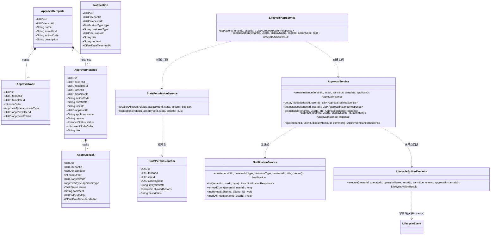
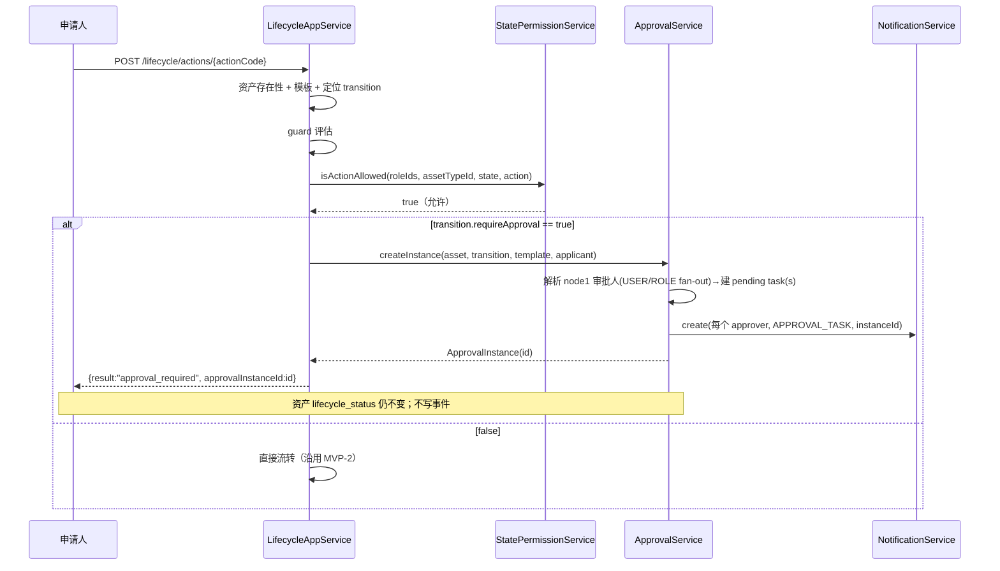
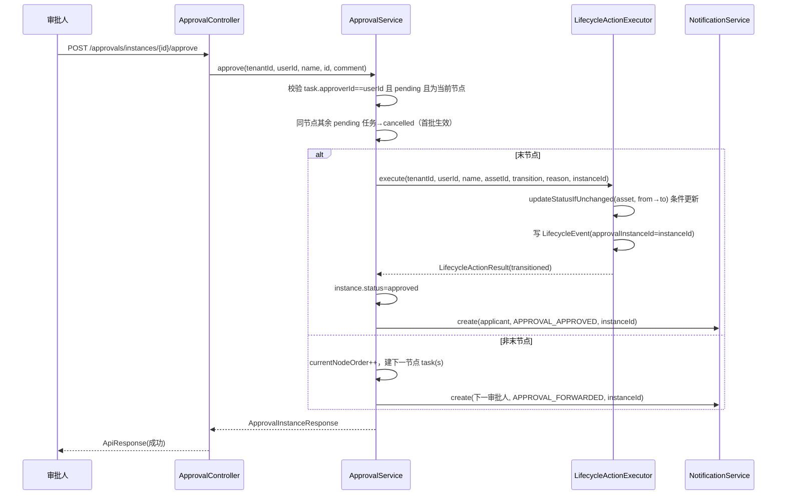
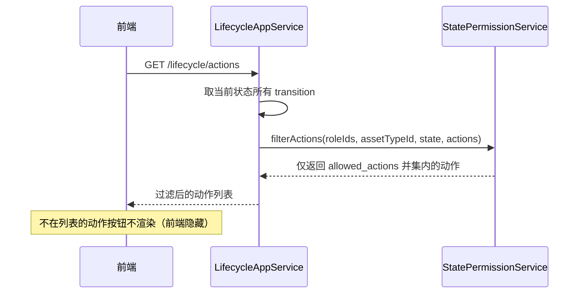
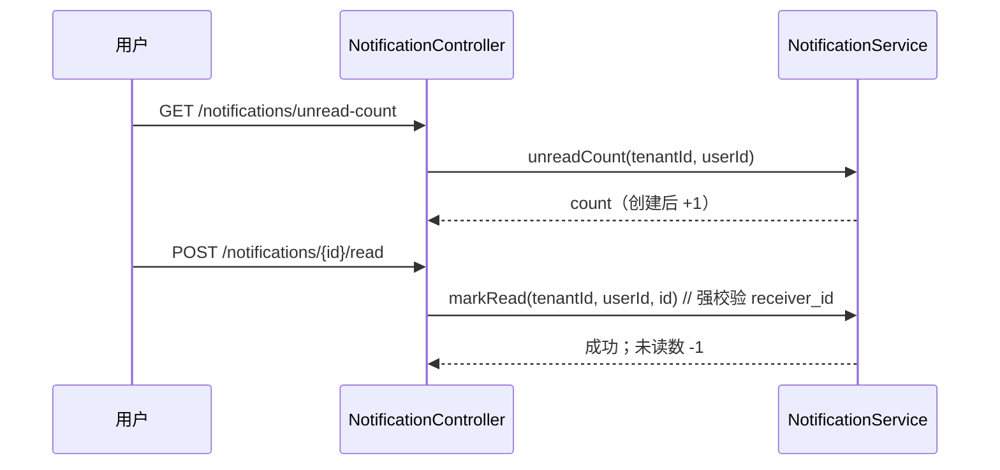
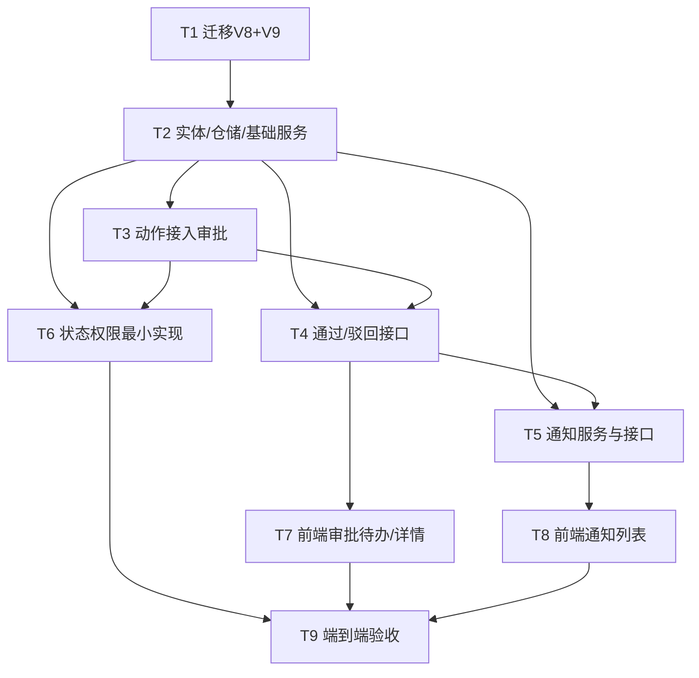

# IT 资产管理系统 MVP-3 架构设计 + 任务分解（ARCHITECTURE）

> 作者：架构师 高见远（software-architect）
> 阶段：MVP-3（审批 · 通知 · 状态权限）
> 依据：`docs/mvp3/PRD.md`、用户《MVP-3开发提示词.md》、仓库代码核查（`backend/`、`frontend/`）
> 技术栈（红线，固定）：后端 Spring Boot 3 + Java 21 + Spring Data JPA/Hibernate6 + Flyway + PostgreSQL；前端 Vue 3 + TypeScript + Vite + Element Plus；`context-path=/api`；统一信封 `ApiResponse<T>`；包名 `com.itam`。
> 本文档仅做**设计 + 任务分解**，不写实现代码。

---

## 0. 关键事实与既有约束（来自代码核查）

设计前对仓库实际代码做了核查，以下结论直接决定设计形态，请工程师严格遵守：

| # | 核查结论 | 对 MVP-3 的影响 |
|---|---|---|
| F1 | 仓库实际迁移为 **V1~V7**（非用户提示的 V1~V5）。最新为 `V7__lifecycle_seed.sql`。 | 本次**新增 V8（结构）+ V9（种子）**接续 V7；**绝不改动 V1~V7**。 |
| F2 | `lifecycle:transition` 权限码**已在 V7 注册并绑定 tenant_admin**（V7 第 153、156-160 行）。 | **Q6 决策落地为「无需补登」**；状态权限解析器不再重复校验该码（控制器 `@PreAuthorize` 已保证）。 |
| F3 | `lifecycle_events` 表**已有 `approval_instance_id` 列**，`LifecycleEvent` 实体已有该字段（当前恒 `null`）。 | 审批通过回调写事件时，仅需把该字段填为实例 ID，无需改表/实体。 |
| F4 | `LifecycleAppService.executeAction` 已存在 `requireApproval` 分支：仅审计并返回 `approval_required`，状态不变、不写事件（第 133-138 行）。`LifecycleActionResult` 已含 `approvalInstanceId` 字段。 | MVP-3 把「仅审计」升级为「创建审批实例 + 任务 + 通知」；返回结构保持不变。 |
| F5 | 全部租户业务表继承 `com.itam.common.base.TenantEntity`（强制 `tenant_id`），软删除由 `@Where(clause="deleted=false")` 处理；查询方法均显式传 `tenantId`。 | 6 张新表全部继承 `TenantEntity`，保持隔离写法一致。 |
| F6 | 鉴权用 `@PreAuthorize("principal.userType.name()=='TENANT' and hasAuthority('xxx')")`；权限码映射为 Spring Security `authority`（`JwtUserPrincipal`）。 | 新接口沿用同模式；`tenant_id/userId/displayName` 一律取自 `JwtUserPrincipal`，前端不可伪造。 |
| F7 | 前端 `request.ts` 自动解包 `{code,message,data,traceId}`；非 0 码时 `ElMessage.error` 并 reject；`useViewState` 提供 loading/empty/error/no-permission/ready 四态。 | 前端无需改请求层；页面按四态渲染即可。 |
| F8 | `AssetDetailView.vue` 第 166-169 行已有 `approval_required` 分支占位（提示「审批模块将在 MVP-3 实现」）。 | T7 仅需把该分支改为「展示 approvalInstanceId、不刷新状态」。 |
| F9 | 演示租户 `b2222222...` 的管理员用户 `c3333333...` 绑定角色 `tenant_admin`(`d4444444...`)，且 V7 把 `lifecycle:*` 绑定该角色。 | ROLE 扇出（fan-out）到 `tenant_admin` 会在演示租户产生真实待办；端到端验收可直接跑通。 |
| F10 | 菜单为**后端驱动**（`menuStore.fetchMenu()` 来自 `menu` 表/接口）。 | 审批/通知入口需在既有菜单机制下补登（见 §4 V9 种子与 §7 T7/T8）。 |

---

## 1. 实现方案 + 框架选型

### 1.1 框架选型（复用既有栈，零新增依赖）

| 维度 | 选型 | 说明 |
|---|---|---|
| 后端核心 | Spring Boot 3 / Java 21 / Spring Data JPA / Hibernate 6 | 完全复用，不引入新品 |
| 数据迁移 | Flyway（V8 结构 + V9 种子） | 延续 V1~V7 幂等写法（`IF NOT EXISTS` / `ON CONFLICT DO NOTHING` / `WHERE deleted=false` 部分索引） |
| JSONB | Hibernate `@JdbcTypeCode(SqlTypes.JSON)` | `state_permission_rules.allowed_actions` 直接复用既有写法（同 `guard_rule`） |
| 事务 | Spring `@Transactional` | 审批创建/通过/驳回、生命周期流转各为独立事务边界 |
| 前端 | Vue 3 + TS + Vite + Element Plus + Pinia | 复用 `api/`、`store/`、`useViewState`、`StateView` |
| 鉴权 | Spring Security `@PreAuthorize` + JWT | 复用，权限码映射为 authority |

**结论：除测试依赖（已具备）外，新增第三方依赖为 0。**

### 1.2 新增模块包结构

```
com.itam
├── approval                      # 新增：审批模块
│   ├── entity      ApprovalTemplate / ApprovalNode / ApprovalInstance / ApprovalTask
│   ├── repository  ApprovalTemplateRepository / ApprovalNodeRepository
│   │               ApprovalInstanceRepository / ApprovalTaskRepository
│   ├── application ApprovalService
│   ├── controller  ApprovalController
│   └── dto         ApprovalInstanceResponse / ApprovalTaskResponse / DecisionRequest ...
├── notification                 # 新增：通知模块
│   ├── entity      Notification
│   ├── repository  NotificationRepository
│   ├── application NotificationService
│   ├── controller  NotificationController
│   └── dto         NotificationResponse ...
├── metadata                     # 既有模块，仅新增状态权限
│   ├── entity      StatePermissionRule        （新增）
│   ├── repository  StatePermissionRuleRepository（新增）
│   └── application StatePermissionService    （新增：解析器，被 lifecycle 调用）
└── lifecycle                    # 既有模块，改造
    ├── application LifecycleAppService（改造 executeAction/getActions）
    │               LifecycleActionExecutor（新增：抽取"直转+写事件"逻辑）
    └── controller  LifecycleController（基本不变）
```

### 1.3 关键架构决策：避免循环依赖

`LifecycleAppService.executeAction` 在需审批时须**创建审批实例**（依赖 `ApprovalService`）；而 `ApprovalService.approve` 在末节点通过后又须**真正执行生命周期流转+写事件**（依赖生命周期能力）。若 `ApprovalService` 直接反向依赖 `LifecycleAppService` 会形成循环依赖。

**解法**：从 `LifecycleAppService.executeAction` 的「步骤 7-8（条件更新 + 写事件）」抽取出独立的 `LifecycleActionExecutor`（位于 `com.itam.lifecycle.application`），承载「在已校验前提下完成状态流转并写事件（可带 `approvalInstanceId`）」的纯执行逻辑。

依赖方向变为单向无环：
```
LifecycleAppService ──▶ ApprovalService ──▶ LifecycleActionExecutor
        │                      │
        └──▶ StatePermissionService (metadata)
ApprovalService ──▶ NotificationService
```
- 直转路径：`LifecycleAppService.executeAction` → 调 `LifecycleActionExecutor.execute(...)`（无需审批时）。
- 审批通过路径：`ApprovalService.approve(末节点)` → 调 `LifecycleActionExecutor.executeApproved(...)`（回填 `approvalInstanceId`）。

---

## 2. 6 个待确认问题的最终决策（固化）

以下决策**全部采用用户给定的推荐默认值**，并在设计中强制落地，工程师无需再确认。

| 问题 | 最终决策 | 设计落点 |
|---|---|---|
| **Q1 通知隔离** | **双隔离**：`tenant_id` + `receiver_id` 双重隔离；读/已读接口服务端强校验 `receiver_id == 当前用户`，越权按「不存在」返回 `ASSET_NOT_FOUND(40401)`。 | `NotificationRepository` 查询全部带 `(tenantId, receiverId)`；`markRead/markAllRead` 用条件更新 + 强校验。见 §4、§7 T5。 |
| **Q2 审批人来源** | **单节点默认**；`USER`→建 1 个 task；`ROLE`→提交时解析角色成员，**fan-out 为每个成员各建 1 个 pending task**；**首批生效、其余取消**（同节点第一个审批后，其余同节点 pending 任务自动取消）。天然满足「非审批人即使有权限也不能审批」。 | `ApprovalService.createInstance` 按 node 扇出；`approve` 时对同节点其余 pending 任务置 `cancelled`。种子模板用 `ROLE`→`tenant_admin`。见 §4、§6 场景 A/B。 |
| **Q3 驳回后重提** | **不做撤回/重提专属功能**；驳回后实例=`rejected`、资产不变；再次执行=用户重新发起同一动作=新建审批实例。 | 仅实现「驳回」与「重新发起=新实例」，不实现撤回/重提接口。 |
| **Q4 状态权限多规则命中** | **取所有命中规则 `allowed_actions` 的并集（Union）**——任一规则允许即可执行。 | `StatePermissionService` 收集 role×type×state 命中规则，聚合 `allowed_actions` 并集后判定。见 §7 T6。 |
| **Q5 多节点种子** | **服务层支持顺序多节点**（数据模型与逻辑就绪），**种子仅单节点**；验收以单节点为主。 | `ApprovalNode.nodeOrder` + `ApprovalInstance.currentNodeOrder` 支持多节点；V9 只种单节点模板；多节点仅作 P2 展示增强。 |
| **Q6 `lifecycle:transition` 权限码** | 经核查（F2）**MVP-2 已注册**，V9 **无需补登**。 | 状态权限解析器不再校验该码；控制器 `@PreAuthorize` 已保证。V9 仅注册 5 个新码（见 §4）。 |

---

## 3. 数据库设计（V8 结构 + V9 种子）

### 3.1 V8（结构迁移）—— 6 张新表 + 1 列扩展

延续 V1~V7 约定：主键 `uuid default gen_random_uuid()`；租户表带 `tenant_id` 且继承 `TenantEntity` 公共列（`created_at/updated_at/created_by/updated_by/deleted`）；软删除 `deleted boolean not null default false`；唯一约束用部分唯一索引 `WHERE deleted=false`；JSONB 默认 `'[]'::jsonb`/`'{}'::jsonb`；不建物理外键（仅应用层校验同租户）。

**新增列**：`lifecycle_transitions` 增加 `approval_template_id uuid`（nullable），关联审批模板。

**6 张表核心列**：

| 表 | 核心列 | 状态枚举 / 说明 |
|---|---|---|
| `approval_templates` | `id, tenant_id, name, asset_kind(nullable), action_code, description` | 模板（单节点默认）。`asset_kind` 为空表示全大类适用。 |
| `approval_nodes` | `id, tenant_id, template_id, node_order, approver_type(USER/ROLE), approver_user_id(nullable), approver_role_id(nullable)` | 单节点：1 行，`node_order=1`。 |
| `approval_instances` | `id, tenant_id, template_id, asset_id, transition_id, action_code, from_state, to_state, applicant_id, applicant_name, reason, status, current_node_order, title` | `status`: `pending/approved/rejected/cancelled`。 |
| `approval_tasks` | `id, tenant_id, instance_id, node_order, approver_id, approver_type, status, comment, decided_by, decided_at` | `status`: `pending/approved/rejected/cancelled`。`approver_id` 为具体平台用户，是「非审批人不能审批」的硬保证。 |
| `notifications` | `id, tenant_id, receiver_id, type, business_type, business_id, title, content, read_at(nullable)` | `type`: `APPROVAL_TASK/APPROVAL_APPROVED/APPROVAL_REJECTED/APPROVAL_FORWARDED`。 |
| `state_permission_rules` | `id, tenant_id, role_id, asset_type_id(nullable), lifecycle_state, allowed_actions(jsonb), description` | `asset_type_id` 为空=全类型生效；`allowed_actions` 为动作码数组。 |

> 索引约定（示例）：`ux_approval_instances_tenant_asset (tenant_id, asset_id) WHERE deleted=false`；`idx_approval_tasks_tenant_approver (tenant_id, approver_id, status) WHERE deleted=false`；`idx_notifications_tenant_receiver_read (tenant_id, receiver_id, read_at) WHERE deleted=false`。

### 3.2 V9（种子迁移）

1. **权限码（5 个，module='approval'/'notification'）**，并绑定 `tenant_admin`(`d4444444...`)：
   - `approval:view`（审批-查看）、`approval:approve`（审批-通过）、`approval:reject`（审批-驳回）
   - `notification:view`（通知-查看）、`notification:read`（通知-已读）
   - ⚠️ `lifecycle:transition` **已存在，跳过**（F2/Q6）。
2. **4 个默认审批模板（单节点，ROLE→tenant_admin）** + 对应 4 个 `approval_nodes`：
   - `ATP-SUBMIT-PURCHASE`（tangible & intangible 的 `submit_purchase` 共用）
   - `ATP-RETIRE`（retire）
   - `ATP-ASSIGN-LICENSE`（assign_license）
   - `ATP-RENEW-LICENSE`（renew_license）
   - 每个 node：`approver_type=ROLE, approver_role_id=d4444444...`。
3. **关联 5 个需审批过渡**：`UPDATE lifecycle_transitions SET require_approval=true, approval_template_id=<对应模板> WHERE id IN (...)`：
   - `e1111111...101` tangible:submit_purchase → ATP-SUBMIT-PURCHASE
   - `e1111111...108` tangible:retire → ATP-RETIRE
   - `e2222222...201` intangible:submit_purchase → ATP-SUBMIT-PURCHASE
   - `e2222222...203` intangible:assign_license → ATP-ASSIGN-LICENSE
   - `e2222222...206` intangible:renew_license → ATP-RENEW-LICENSE
4. **（可选，F10）菜单补登**：若 `menu` 表存在，插入「审批待办」「通知中心」两条菜单（绑定 `approval:view`/`notification:view`）。如不存在则前端路由即入口，T7/T8 仅加路由。

---

## 4. 数据结构与接口（类图 + API）

### 4.1 类图（实体 + 关键服务）



### 4.2 实体字段要点（节选）

| 实体 | 关键字段 | 说明 |
|---|---|---|
| `ApprovalInstance` | `status: pending/approved/rejected/cancelled`；`currentNodeOrder`；`applicantId/applicantName`；`fromState/toState/actionCode`；`title` | 一次生命周期动作审批的聚合根；`asset_id`+`transition_id` 记录业务上下文。 |
| `ApprovalTask` | `approverId`（具体用户）；`nodeOrder`；`status: pending/approved/rejected/cancelled`；`comment`；`decidedBy/decidedAt` | **`approverId` 是「非审批人不能审批」的硬保证**：approve/reject 仅作用于 `approverId == 当前用户` 的 pending 任务。 |
| `Notification` | `receiverId`；`type`；`businessType/businessId`（指向 instance）；`readAt`(nullable) | 双隔离；`readAt` 非空即已读。 |
| `StatePermissionRule` | `roleId`；`assetTypeId`(nullable)；`lifecycleState`；`allowedActions`(JSONB 数组) | 命中条件 = `role_id` 且（`asset_type_id` 为空 或 等于资产类型）且 `lifecycle_state` 等于当前状态。 |

### 4.3 关键 API 端点

所有路径前缀 `/api`（`context-path`），完整前缀 `/api/v1/...`。响应统一 `ApiResponse<T> = { code, message, data, traceId }`。

| # | 方法 + 路径 | 权限码（`@PreAuthorize`） | 请求 | 响应 `data` | 说明 |
|---|---|---|---|---|---|
| A1 | `GET /api/v1/approvals/tasks/my` | `approval:view` | query: `status?` | `List<ApprovalTaskResponse>`（含实例上下文） | 我的待办：当前用户为 pending 审批人的任务。 |
| A2 | `GET /api/v1/approvals/instances` | `approval:view` | query: `status?` | `List<ApprovalInstanceResponse>` | 审批实例列表（租户隔离）。 |
| A3 | `GET /api/v1/approvals/instances/{id}` | `approval:view` | — | `ApprovalInstanceResponse`（基础信息 + 业务上下文 + 任务历史） | 详情；当前用户为 pending 审批人时前端显示操作按钮。 |
| A4 | `POST /api/v1/approvals/instances/{id}/approve` | `approval:approve` | body: `DecisionRequest{comment?}` | `ApprovalInstanceResponse` | 通过：末节点→回调流转+写事件+通知申请人；非末节点→建下一节点任务+通知下一审批人；同节点其余 pending 任务取消。 |
| A5 | `POST /api/v1/approvals/instances/{id}/reject` | `approval:reject` | body: `DecisionRequest{comment}`（必填） | `ApprovalInstanceResponse` | 驳回：实例/任务=`rejected`，资产状态不变、不写事件；通知申请人。 |
| N1 | `GET /api/v1/notifications` | `notification:view` | query: `type?` | `List<NotificationResponse>` | 我的通知（按 `receiver_id+tenant_id` 隔离）。 |
| N2 | `GET /api/v1/notifications/unread-count` | `notification:view` | — | `long` | 未读数。 |
| N3 | `POST /api/v1/notifications/{id}/read` | `notification:read` | — | `void` | 标记已读；服务端强校验 `receiver_id`，越权按 `ASSET_NOT_FOUND(40401)`。 |
| N4 | `POST /api/v1/notifications/read-all` | `notification:read` | — | `void` | 全部已读（条件更新 `read_at is null`）。 |
| （既有） | `POST /api/v1/assets/{id}/lifecycle/actions/{actionCode}` | `lifecycle:transition` | `ExecuteActionRequest` | `LifecycleActionResult{result, fromState, toState, approvalInstanceId, eventId}` | 改造：需审批时 `result=approval_required` 且 `approvalInstanceId` 非空、状态不变。 |
| （既有） | `GET /api/v1/assets/{id}/lifecycle/actions` | `lifecycle:view` | — | `List<LifecycleActionResponse>` | 改造：经 `StatePermissionService.filterActions` 过滤不允许动作。 |

**关键校验语义（后端强约束）**：
- A4/A5 若当前用户不是该 pending 任务的 `approverId` → `BUSINESS_RULE_VIOLATION(42200)`「您不是该审批任务的审批人」（即便有 `approval:approve/reject` 权限也不行）。
- A4/A5 若实例非 `pending` 或目标任务非当前节点 pending → `BUSINESS_RULE_VIOLATION(42200)`。
- 状态权限拦截（executeAction）：命中规则且动作不在 `allowed_actions` 并集 → `BUSINESS_RULE_VIOLATION(42200)`，并写审计。

### 4.4 主要 DTO

- `ApprovalInstanceResponse`：`id, title, assetId, actionCode, actionName, fromState, toState, applicantId, applicantName, reason, status, currentNodeOrder, createdAt, tasks: List<ApprovalTaskResponse>`
- `ApprovalTaskResponse`：`id, instanceId, nodeOrder, approverId, approverName, approverType, status, comment, decidedAt, canDecide(bool)`
- `DecisionRequest`：`comment: String`（reject 必填；approve 可选）
- `NotificationResponse`：`id, type, businessType, businessId, title, content, readAt, createdAt`
- 既有 `LifecycleActionResult` 已含 `approvalInstanceId`，无需改。

---

## 5. 程序调用流程（时序图）

### 5.1 场景 1：提交需审批动作 → 创建审批，状态不变



### 5.2 场景 2：审批通过（末节点）→ 真正流转 + 写事件 + 通知



### 5.3 场景 3：驳回 → 状态不变、不写事件、通知申请人

```mermaid
sequenceDiagram
    participant A as 审批人
    participant AP as ApprovalService
    participant N as NotificationService
    A->>AP: POST /approvals/instances/{id}/reject(comment)
    AP->>AP: 校验 approverId==userId 且 pending
    AP->>AP: task.status=rejected; instance.status=rejected
    AP->>N: create(applicant, APPROVAL_REJECTED, instanceId, comment)
    AP-->>A: ApprovalInstanceResponse(状态=rejected)
    Note over A,N: 资产 lifecycle_status 仍不变；无 LifecycleEvent
```

### 5.4 场景 4：状态权限过滤（前端隐藏不可执行动作）



### 5.5 场景 5：通知已读



---

## 6. 任务列表（T1..T9，有序 + 依赖）

> 严格按开发优先级排序；T 编号即实现顺序。后端包路径省略 `backend/src/main/java/com/itam/` 前缀，前端省略 `frontend/src/`。

| 任务 | 名称 | 源文件（后端 / 前端） | 依赖 | 优先级 |
|---|---|---|---|---|
| **T1** | 数据库迁移 V8 结构 + V9 种子 | `resources/db/migration/V8__mvp3_approval_notification_structure.sql`、`V9__mvp3_seed.sql` | — | P0 |
| **T2** | 审批/通知/状态权限 实体 + 仓储 + 基础服务 | **后端**：`approval/entity/{ApprovalTemplate,ApprovalNode,ApprovalInstance,ApprovalTask}.java`、`approval/repository/*Repository.java`、`notification/entity/Notification.java`、`notification/repository/NotificationRepository.java`、`metadata/entity/StatePermissionRule.java`、`metadata/repository/StatePermissionRuleRepository.java`、`approval/application/ApprovalService.java`(createInstance+查询)、`approval/dto/*`、`approval/controller/ApprovalController.java`(tasks/my,instances,instances/{id})、`notification/application/NotificationService.java`(create)、`notification/dto/*`、`notification/controller/NotificationController.java`(骨架) | T1 | P0 |
| **T3** | 生命周期动作接入审批 | **后端**：`lifecycle/application/LifecycleAppService.java`(改造：注入 ApprovalService+StatePermissionService；requireApproval 分支改「创建实例+返回 approval_required」；状态权限 hook 调 `StatePermissionService.isActionAllowed`)、`lifecycle/dto/LifecycleActionResult.java`(确认字段)、`lifecycle/controller/LifecycleController.java`(注释更新) | T2 | P0 |
| **T4** | 审批通过 / 驳回接口 | **后端**：`lifecycle/application/LifecycleActionExecutor.java`(新增，抽取直转+写事件)、`approval/application/ApprovalService.java`(approve/reject + 末节点回调 + 非末节点建任务 + 首批生效其余取消)、`approval/controller/ApprovalController.java`(新增 approve/reject)、`approval/dto/DecisionRequest.java` | T2,T3 | P0 |
| **T5** | 通知服务与接口 | **后端**：`notification/application/NotificationService.java`(完善 list/unreadCount/markRead/markAllRead)、`notification/controller/NotificationController.java`(N1~N4)、`notification/dto/NotificationResponse.java`、`approval/application/ApprovalService.java`(建实例/通过/驳回/流转处接入发通知) | T2,T4 | P0 |
| **T6** | 状态权限最小实现 | **后端**：`metadata/application/StatePermissionService.java`(isActionAllowed 并集 + filterActions)、`lifecycle/application/LifecycleAppService.java`(getActions 调 filterActions；executeAction 二次拦截)、`metadata/entity/StatePermissionRule.java`/`repository`(T2 已建，本任务消费) | T2,T3 | P0 |
| **T7** | 前端审批待办与详情 | **前端**：`api/approval.ts`(新)、`types.ts`(扩展 ApprovalInstance/ApprovalTask)、`router/index.ts`(approval/tasks, approval/instances/:id)、`views/approval/ApprovalTodoView.vue`(新)、`views/approval/ApprovalDetailView.vue`(新)、`views/asset/AssetDetailView.vue`(改造 approval_required 分支：展示实例ID、不刷新状态) | T4 | P1 |
| **T8** | 前端通知列表 | **前端**：`api/notification.ts`(新)、`types.ts`(扩展 Notification)、`router/index.ts`(notification/list)、`views/notification/NotificationListView.vue`(新)、`components/notification/NotificationBell.vue`(新, 顶部铃铛 Badge+未读)、`views/MainLayout.vue`(接入 Bell+菜单)、`constants/permissions.ts`(扩展目录)、`store/notification.ts`(可选未读轮询) | T5 | P1 |
| **T9** | 端到端验收与修复 | 无新文件；补 `ApprovalControllerTest`/`NotificationControllerTest`/`StatePermissionTest` 及前端联调修复；按需微调 V9 种子(menu 行) 与 types | T6,T7,T8 | P1 |

**依赖关系图**：



---

## 7. 依赖包列表

**基本零新增**（仅复用既有栈与测试依赖）：

| 包 / 依赖 | 用途 | 是否新增 |
|---|---|---|
| Spring Boot Starter Web / Data JPA / Security | Web/ORM/鉴权 | 既有 |
| Flyway Core | 迁移 V8/V9 | 既有 |
| PostgreSQL Driver | 数据库 | 既有 |
| Hibernate 6（`@JdbcTypeCode(SqlTypes.JSON)`） | JSONB 映射 | 既有 |
| Lombok | 实体/DTO 简化 | 既有 |
| Spring Security Test / JUnit 5 / Mockito | T9 测试 | 既有 |
| **无新增第三方库** | — | — |

> 说明：JSONB、UUID、部分唯一索引、条件更新等能力均已在 V1~V7 与 MVP-2 中使用，无需引入新依赖。

---

## 8. 共享知识（跨文件约定）

| 主题 | 约定 |
|---|---|
| **错误码** | `SUCCESS(0)` / `NO_PERMISSION(40300)` / `ASSET_NOT_FOUND(40401)` / `CONFLICT(40900)` / `BUSINESS_RULE_VIOLATION(42200)`。HTTP 映射由 `GlobalExceptionHandler` 完成（403/404/409/422）。 |
| **审批越权/非审批人** | 返回 `BUSINESS_RULE_VIOLATION(42200)`，message：「您不是该审批任务的审批人」或「审批实例状态不正确」。 |
| **状态权限拦截** | executeAction 命中规则且动作不在并集 → `BUSINESS_RULE_VIOLATION(42200)` + 审计。getActions 直接过滤（前端隐藏）。 |
| **事务边界** | `executeAction`、`createInstance`、`approve`、`reject`、`markRead/markAllRead` 各自 `@Transactional`；审批通过的事务内完成「流转+写事件+通知」以保证一致。 |
| **租户隔离写法** | 所有租户表继承 `TenantEntity`；Repository 查询方法首参恒为 `tenantId`；`tenantId/userId/displayName` 一律从 `JwtUserPrincipal` 取，**绝不信任前端传入**。 |
| **通知双隔离** | `NotificationRepository` 查询/更新均带 `(tenantId, receiverId)`；`markRead` 用 `WHERE id=? AND tenant_id=? AND receiver_id=?`，越权自然「查无此通知」→ `ASSET_NOT_FOUND(40401)`。 |
| **Flyway 约定** | 结构=V8、种子=V9；`CREATE TABLE IF NOT EXISTS` + `IF NOT EXISTS` 索引 + `ON CONFLICT DO NOTHING` 幂等；不碰 V1~V7；种子用固定 UUID 便于交叉引用。 |
| **状态/枚举存储** | 实例/任务状态、`approver_type`、`notification.type` 用字符串枚举（与 MVP-2 `lifecycle_transitions` 风格一致），`allowed_actions` 用 JSONB 数组。 |
| **日期/UUID** | 时间用 `OffsetDateTime`/PG `timestamptz`（ISO 8601 UTC）；ID 用 UUID（字符串传输）。 |
| **响应信封** | 统一 `ApiResponse<T>{code,message,data,traceId}`；`ApiResponse.success(data)` / `fail(ResultCode,...)`。 |
| **审计** | 审批创建/通过/驳回/状态权限拦截/越权尝试均调用既有 `AuditLogService.log(...)`（action 如 `LIFECYCLE_APPROVAL_REQUIRED`/`APPROVAL_DECISION`/`STATE_PERMISSION_DENIED`）。 |
| **并发保护** | 沿用 MVP-2 `@Modifying` 条件更新模式（影响行数 0 → `CONFLICT(40900)`）；资产状态仅经 `updateStatusIfUnchanged` 变更。 |

---

## 9. 待明确事项

仅 1 项需主理人知悉的**现实更正**（非阻塞，设计已按此落地）：

- **迁移版本更正**：用户提示「现有迁移 V1~V5」，但仓库实际为 **V1~V7**（V6/V7 为 MVP-2 生命周期建表与种子）。本文档据此将本次设计为 **V8（结构）+ V9（种子）**，并明确「绝不改动 V1~V7」。若主理人确认仓库另有 V5 之后的私有迁移，请同步，否则按 V8/V9 执行。
- 其余 6 个待确认问题已在 §2 全部固化为推荐默认值，无需再确认。
- 菜单入口（F10）：若 `menu` 表存在则在 V9 补登两条菜单；否则前端仅加路由。T7/T8 实现时按既有菜单机制处理即可，不新增设计决策。

---

## 10. 交付给工程师的任务顺序汇总

> （详见 §6 任务列表与依赖图）

1. **T1** 数据库迁移 V8 结构 + V9 种子
2. **T2** 审批/通知/状态权限 实体 + 仓储 + 基础服务（createInstance + 查询 + 通知 create）
3. **T3** 生命周期动作接入审批（executeAction 返回 `approval_required`，不改进状态）
4. **T4** 审批通过 / 驳回接口（末节点回调 `LifecycleActionExecutor` 真正流转 + 写事件；非末节点建下一节点；首批生效其余取消）
5. **T5** 通知服务与接口（list / unread-count / markRead / markAllRead + 双隔离强校验）
6. **T6** 状态权限最小实现（并集解析 + getActions 过滤 + executeAction 二次拦截）
7. **T7** 前端审批待办与详情（含资产详情页 `approval_required` 分支改造）
8. **T8** 前端通知列表（含顶部铃铛 Badge）
9. **T9** 端到端验收与修复（补测试 + 联调）

**共 9 个任务（T1~T9）**，严格按上述顺序、依赖关系递进；后端零新增依赖；前端复用既有 `api/store/useViewState/StateView`。
