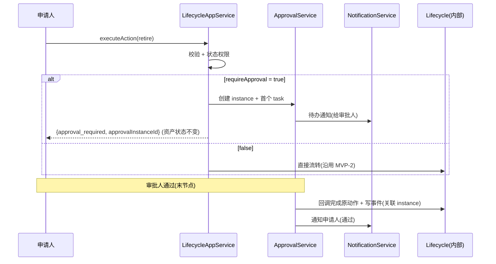

# IT资产管理系统 MVP-3 审批·通知·状态权限 — 产品需求文档（简单 PRD）

> 作者：产品经理 许清楚（Xu）
> 阶段：MVP-3（基于 MVP-0/1/2 已交付能力）
> 项目代号：`itam_mvp3`
> 技术栈（固定，不得自行切换）：后端 Spring Boot 3 + Java 21 + Spring Data JPA/Hibernate6 + Flyway + PostgreSQL；前端 Vue 3 + TypeScript + Vite + Element Plus；`context-path=/api`；统一响应 `ApiResponse<T>`；包名 `com.itam`。
> 配套依据：`MVP-3开发提示词.md`（用户规格）、`docs/mvp/` 系列设计文档。
> 文档类型：简单 PRD（产品目标 + 用户故事 + 需求池 + UI 设计稿 + 待确认问题），不含竞品分析。

---

## 1. 项目信息

| 项 | 内容 |
|---|---|
| 文档语言 | 简体中文 |
| 前端技术栈 | Vue 3 + TypeScript + Vite + Element Plus |
| 后端技术栈 | Spring Boot 3 + Java 21 + Spring Data JPA/Hibernate6 + Flyway + PostgreSQL |
| 项目代号 | `itam_mvp3` |
| 包名（红线） | `com.itam`（禁止改用 `com.company.itam`） |
| 迁移版本 | V8（结构）接续当前最新 V7；V9（种子） |
| 明确禁止扩展 | 报表、导入导出、附件、复杂审批流设计器、BPMN、会签/抄送/转办/委托/超时升级、邮件/Webhook、审批撤回/重新提交 |

**原始需求复述**：在 MVP-2 已交付的生命周期状态机之上，MVP-3 补齐「生命周期动作需审批」的最小闭环，并提供站内通知与基础状态权限控制。核心三块能力——审批实例（approval）、通知（notification）、状态权限（state permission）——且生命周期动作要接入审批。用户已给出审批规则、通知测试要求、状态权限测试要求、端到端验收场景（采购申请审批 / 退役驳回 / 状态权限拦截 / 通知已读）与开发优先级顺序（迁移→实体/服务→动作接入审批→通过/驳回接口→通知→状态权限→前端待办/详情→通知列表→端到端验收）。

---

## 2. 产品定义

### 2.1 产品目标（北极星：3 个正交目标）

| # | 目标 | 说明 / 度量 |
|---|---|---|
| **G1 审批闭环** | 需审批的生命周期动作不再即时改状态，而是创建审批实例与任务；末节点审批通过后回调生命周期完成状态流转并写事件。 | 端到端场景 1/2 全绿；审批通过后才变更 `lifecycle_status`；驳回后状态不变、不写事件。 |
| **G2 通知可达** | 审批创建/通过/驳回产生站内通知，申请人/审批人及时知晓；未读数正确、可标记已读。 | 通知测试 5 项全绿；未读数随创建 +1、标记已读后 -1；不能读他人通知。 |
| **G3 状态权限可控** | 在功能权限之上，按「角色×资产类型×生命周期状态×动作」增加状态级权限，前端隐藏不可执行动作、后端二次拦截。 | 状态权限测试 5 项全绿；无规则仅按功能权限放行；有规则且动作不在列表内拦截。 |

### 2.2 用户故事

- **US-1（申请人 / 资产管理员）**：作为资产申请人，我希望执行 `retire`/`submit_purchase` 等需审批动作时系统创建审批而非直接改状态，以便关键变更经过审批并留痕。
- **US-2（审批人）**：作为审批人，我希望在待办中看到分配给我的审批、查看业务上下文（资产/动作/原状态/目标状态/原因），并能通过或驳回（驳回须填意见），以便高效决策。
- **US-3（申请人）**：作为申请人，我希望审批通过/驳回后收到站内通知，以便及时跟进资产状态变化。
- **US-4（租户管理员）**：作为租户管理员，我希望通过状态权限规则限制某些角色不能执行 `retire` 等动作，以便关键操作受控（前端隐藏 + 后端拦截 + 可审计）。
- **US-5（审批人）**：作为审批人，我希望我的未读通知可标记已读、未读数实时反映，以便聚焦真正待办。

---

## 3. 需求池

> 优先级：P0 = 必须（审批接入生命周期 / 通知 / 状态权限核心，MVP-3 验收门槛）；P1 = 重要（端到端场景 / 已读闭环 / 前端页面）；P2 = 可选（体验优化）。
> 验收要点应可被 MVP-3 后端/前端测试直接引用。

### 3.1 P0（必须 — 核心）

| 编号 | 描述 | 验收要点 |
|---|---|---|
| **M3-P0-01 数据库迁移 V8/V9** | 新增 6 张表（approval_templates / approval_nodes / approval_instances / approval_tasks / notifications / state_permission_rules），均带 `tenant_id` + 公共审计字段 + 软删除；`lifecycle_transitions` 增加 `approval_template_id`；V9 种子：权限码 `approval:view/approve/reject`、`notification:view/read`、4 个默认模板、单节点、5 个需审批过渡关联（`tangible: submit_purchase`/`tangible: retire`/`intangible: submit_purchase`/`intangible: assign_license`/`intangible: renew_license`）。 | V8/V9 Flyway 可重复执行通过；新表含 `tenant_id/created_by/updated_by/created_at/updated_at/deleted`；种子使 demo 租户可直接验收闭环。 |
| **M3-P0-02 审批实体/仓储** | 审批模板/节点/实例/任务实体与 JPA 仓储，状态枚举（pending/approved/rejected/cancelled）。 | 实体映射正确；种子可加载；租户查询自动注入。 |
| **M3-P0-03 通知实体/仓储** | 站内通知实体与仓储（receiver_id / type / business_type / business_id / read_at）。 | 通知可创建/查询/标记已读；按 receiver_id + tenant_id 隔离。 |
| **M3-P0-04 状态权限实体/仓储** | 状态权限规则实体（role_id / asset_type_id 可空 / lifecycle_state / allowed_actions JSONB）。 | 规则可存储；`asset_type_id` 为空表示全类型生效。 |
| **M3-P0-05 生命周期动作接入审批** | 改造 `LifecycleAppService.executeAction`：存在性/模板/transition/守卫/状态权限校验后，若 `requireApproval=true` → 创建 instance + 首个 task + 待办通知 + 审计，**不改进状态、不写事件**，返回 `{result:"approval_required", approvalInstanceId}`；否则沿用 MVP-2 直转。 | 返回 `approval_required` 且资产状态不变；审批任务已创建；通知已生成。 |
| **M3-P0-06 审批通过接口** | `POST /api/v1/approvals/instances/{id}/approve`：当前用户须为当前 pending task 审批人；末节点→实例 approved + 回调生命周期内部方法完成原动作 + 写生命周期事件（关联 instance）+ 通知申请人；非末节点→建下一节点任务 + 更新 current_node_id + 通知下一审批人。 | 通过末节点后资产状态流转、事件新增；非审批人 403/业务异常；重复审批 pending 外任务返回业务异常。 |
| **M3-P0-07 审批驳回接口** | `POST /api/v1/approvals/instances/{id}/reject`：当前用户须为审批人；task + instance = rejected；资产状态不变；不写事件；通知申请人。 | 驳回后资产状态不变；无生命周期事件；申请人收到驳回通知。 |
| **M3-P0-08 通知服务** | 创建/未读数/标记已读；按 receiver_id + tenant_id 隔离；不能读他人通知。 | 通知测试 5 项全绿（创建/通过驳回通知/未读数/标记已读减少/不可读他人）。 |
| **M3-P0-09 状态权限解析器** | `StatePermissionService`：先满足 `lifecycle:transition` 功能权限；无匹配规则仅按功能权限放行；有规则则动作须在 `allowed_actions`；`getActions` 过滤不允许动作；`executeAction` 二次拦截。 | 状态权限测试 5 项全绿。 |
| **M3-P0-10 审批 API** | `GET tasks/my`、`GET instances`、`GET instances/{id}`、`POST approve`、`POST reject`；权限码 `approval:view/approve/reject`。 | 5 个接口可用；无 `approval:view` 不可看待办；无 approve/reject 不可操作。 |
| **M3-P0-11 通知 API** | `GET /notifications`、`GET /notifications/unread-count`、`POST /notifications/{id}/read`、`POST /notifications/read-all`；权限码 `notification:view/read`。 | 列表/未读数/单读/全读可用；隔离正确。 |
| **M3-P0-12 审批规则与租户隔离/审计** | 无 `approval:reject` 不能驳回；有权限且是审批人可操作；非审批人即使有权限也不能审批；所有新表带 tenant_id；审批创建/通过/驳回写审计日志。 | Controller 测试 5 项全绿；跨租户/越权被拦截；关键写操作 100% 审计。 |

### 3.2 P1（重要 — 端到端 / 已读 / 前端）

| 编号 | 描述 | 验收要点 |
|---|---|---|
| **M3-P1-01 场景1 采购申请审批** | planned 资产 submit_purchase → approval_required + instanceId，资产仍 planned；审批人待办；通过→purchasing + 事件 + 申请人通知。 | 端到端场景 1 全绿。 |
| **M3-P1-02 场景2 退役驳回** | running 资产 retire → 创建审批；驳回→仍 running、不写事件、申请人收驳回通知。 | 端到端场景 2 全绿。 |
| **M3-P1-03 场景3 状态权限拦截** | 某角色不可 retire → 前端不显示 retire；直调后端返回无权限/业务规则错误；可审计追踪。 | 端到端场景 3 全绿。 |
| **M3-P1-04 场景4 通知已读** | 创建审批任务后审批人未读 +1；标记已读后未读减少。 | 端到端场景 4 全绿。 |
| **M3-P1-05 前端审批待办页** | 表格（标题/业务类型/申请人/提交时间/状态/操作）；支持详情/通过/驳回；无 `approval:view` 显示 no-permission。 | 页面可用；权限受控；四态（loading/empty/error/no-permission）。 |
| **M3-P1-06 前端审批详情页** | 实例基础信息 + 业务上下文（资产ID/动作/原状态/目标状态/原因）+ 任务历史；当前用户为 pending 审批人显示通过/驳回按钮；驳回必填意见。 | 详情完整；按钮按审批人身份显隐；驳回校验意见。 |
| **M3-P1-07 前端通知列表** | 通知列表 + 未读数；单条已读/全部已读；点击审批类通知跳转详情。 | 列表/未读/已读可用；跳转正确。 |
| **M3-P1-08 资产详情页接入审批** | 执行需审批动作后提示「已提交审批」并展示 approvalInstanceId；不刷新为新状态（资产状态仍未变）。 | 提示正确；状态不提前变更。 |
| **M3-P1-09 异常与越权** | 非审批人重复审批/越权审批返回业务异常；pending 以外任务审批返回业务异常。 | 异常路径可测、可审计。 |

### 3.3 P2（可选 — 体验优化）

| 编号 | 描述 | 验收要点 |
|---|---|---|
| **M3-P2-01 通知中心入口 Badge** | 顶部铃铛入口 + 未读数 Badge，实时反映 unread-count。 | 入口可用；Badge 与未读数一致。 |
| **M3-P2-02 审批详情多节点时间线增强** | 多节点场景任务历史以时间线展示（顺序/并行标识）。 | 多节点可读；MVP-3 种子为单节点，仅增强展示。 |
| **M3-P2-03 四态规范** | 审批/通知页面统一 loading/empty/error/no-permission 四态。 | 符合 `16-UI设计规范`。 |
| **M3-P2-04 通知分类/筛选** | 按 notification_type 筛选（审批任务/通过/驳回/流转）。 | 筛选可用。 |
| **M3-P2-05 操作二次确认** | 通过/驳回危险操作二次确认；驳回意见必填提示。 | 交互友好，防误操作。 |

---

## 4. UI 设计稿

> 通用规范（沿用 `16-UI设计规范`）：企业级 B 端后台；左侧导航 + 顶部工具栏 + 主内容区；主色稳定蓝；所有页面四态（loading/empty/error/no-permission）；危险操作二次确认；功能权限由 `userStore.hasPermission` + `useViewState` 控制，状态权限由后端二次拦截兜底。

### 4.1 审批待办列表（`approval/tasks`）

```mermaid
flowchart TD
    A[顶部工具栏: 标题"我的审批待办" + 状态筛选 待审/已办/全部] --> B[表格区]
    B --> B1[列: 标题 | 业务类型 | 申请人 | 提交时间 | 状态 | 操作]
    B --> B2[操作列: 查看/通过/驳回 仅 pending 且当前用户为审批人可见]
    B --> B3[分页 + 空状态"暂无待办"]
    B -.无 approval:view.-> C[no-permission 占位]
    B1 -.点击行/查看.-> D[跳转 审批详情页]
```

### 4.2 审批详情（`approval/instances/:id`）

```mermaid
flowchart TD
    A[标题区: 审批标题 + 实例状态标签] --> B[业务上下文卡片]
    B --> B1[资产ID / 动作 / 原状态 → 目标状态 / 原因]
    A --> C[审批任务历史时间线]
    C --> C1[节点1 审批人 状态 意见 时间]
    C --> C2[节点N ...]
    A --> D{当前用户 = pending 审批人?}
    D -- 是 --> E[底部操作栏: 通过(二次确认) / 驳回(必填意见)]
    D -- 否 --> F[仅查看, 无操作按钮]
```

### 4.3 通知列表（`notification/list` + 顶部铃铛入口）

```mermaid
flowchart TD
    A[顶部铃铛 Badge: 未读数] --> B[通知列表页]
    B --> B1[列: 类型图标 | 标题 | 内容摘要 | 时间 | 状态(未读高亮) | 操作]
    B --> B2[操作: 标记已读 / 全部已读]
    B --> B3[筛选: 全部 / 未读 / 按类型]
    B1 -.点击审批类通知.-> C[跳转 审批详情页]
    B -.无 notification:view.-> D[no-permission 占位]
```

### 4.4 核心流程（审批接入生命周期 — 序列）



---

## 5. 待确认问题（附推荐默认值）

以下为 MVP-3 隐含决策点，已附**推荐默认值**；其余规格用户已明确，无需确认。

**Q1. 通知数据模型的隔离策略？**
规格要求「不能读别人的通知」。推荐：**双隔离**——`notifications` 带 `tenant_id` 且查询按当前 token 租户隔离；同时 `receiver_id` 必须等于当前用户，读/已读接口服务端强制校验，杜绝跨用户读。

**Q2. 审批人来源：单审批人还是 USER/ROLE 多来源？任务如何创建？**
规格 `approver_type` 支持 `USER`/`ROLE`。推荐：**单节点默认**；`USER` → 为指定用户建 1 个 task；`ROLE` → 提交时解析角色成员，**fan-out 为每个成员各建 1 个 pending task（首批生效，其余取消）**。这样「非审批人即使有权限也不能审批」可由 `task.approver_id` 天然保证。种子模板用 USER/ROLE 指向 tenant_admin 或 asset_admin。

**Q3. 驳回后是否允许重新提交？**
规格「暂不做」含撤回/重新提交。推荐：**不做「撤回/重提」专属功能**；驳回后实例状态 = rejected、资产不变；如需再次执行，用户重新发起同一生命周期动作（= 新建审批实例）。与边界一致，避免在 MVP-3 引入闭环复杂度。

**Q4. 状态权限多规则命中时的合并策略？**
一个角色可能同时命中「`asset_type_id` 为空（全类型）」与「具体类型」两条规则。推荐：**取所有命中规则 `allowed_actions` 的并集（Union）**——任一规则允许即可执行，更贴近「最小可执行」的宽松放行，且实现简单。

**Q5. 多节点顺序审批在 MVP-3 是否需要真实多节点种子？**
规格服务需支持「多节点审批时第一节点通过后创建下一节点任务」，但验收场景均为单节点。推荐：**服务层支持顺序多节点**（数据模型与逻辑就绪），**种子仅单节点**，端到端验收以单节点为主；多节点作为 P2 展示增强，不阻塞 MVP-3。

**Q6（低风险，确认即可）. `lifecycle:transition` 功能权限是否已存在？**
状态权限解析器以「先满足 `lifecycle:transition` 功能权限」为前提。推荐：架构师确认 MVP-2 已注册该权限码；若未注册需在 V9 种子补登，避免状态权限前置校验误杀。

---

> 文档结束。本简单 PRD 直接交付架构师作为 MVP-3 设计与实现依据；测试同学可将第 3 节验收要点映射至 MVP-3 后端/前端测试用例。
